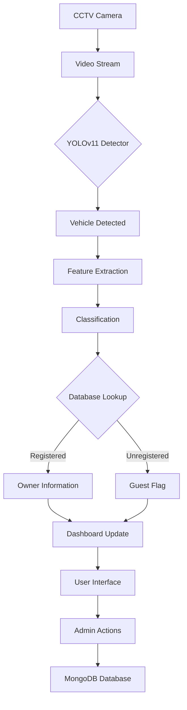

# 🚗 Vehicle Detection and Authentication System

<div align="center">


**Real-time vehicle detection and authentication system with 95% accuracy using YOLOv11**

[View Demo](#live-demo) • [Installation](#-installation) • [Features](#-key-features) • [Documentation](docs/)

</div>

## 📋 Overview

This system provides a comprehensive solution for real-time vehicle detection, classification, and authentication. Using state-of-the-art YOLOv11 model trained on a custom dataset of 40 vehicle types, it achieves **95% accuracy** in vehicle recognition. The system integrates secure authentication, real-time monitoring, and administrative controls for smart parking, traffic management, and security applications.

---

## 🎯 Key Features

### 🔍 **High-Accuracy Detection**
- **95% accuracy** with YOLOv11 model
- **40+ vehicle types** recognition
- **Real-time processing** from CCTV feeds
- **Custom-trained** on diverse vehicle dataset

### 🛡️ **Security & Authentication**
- **Secure user authentication** system
- **Vehicle-owner mapping** database
- **Guest vehicle flagging** for unauthorized vehicles
- **Role-based access control** (Admin/User)

### 📊 **Dashboard & Management**
- **Admin dashboard** for vehicle management
- **Real-time monitoring** interface
- **Analytics and reporting**
- **Vehicle history tracking**

### 🏗️ **Technical Architecture**
- **Flask** web framework backend
- **MongoDB** for scalable data storage
- **Responsive web interface**
- **RESTful API** endpoints

---

## 🖼️ Screenshots

### 🔐 Authentication Page
*Secure login and registration interface*


### 📈 Admin Dashboard
*Comprehensive vehicle management dashboard*


### 🎥 Real-time Monitoring
*Live CCTV feed with vehicle detection overlay*


### 🚗 Vehicle Management
*Database management for registered vehicles*


---

## 🚀 Quick Start

### Prerequisites
- Python 3.8 or higher
- MongoDB 4.4+
- Git
- Web browser (Chrome/Firefox recommended)

### Installation Steps

1. **Clone the repository**
```bash
git clone https://github.com/yourusername/car-dashboard.git
cd car-dashboard
```

2. **Create virtual environment**
```bash
python -m venv venv
source venv/bin/activate  # On Windows: venv\Scripts\activate
```

3. **Install dependencies**
```bash
pip install -r requirements.txt
```

4. **Set up environment variables**
```bash
cp .env.example .env
# Edit .env with your configuration
```

5. **Initialize the database**
```bash
python init_db.py
```

6. **Download model weights**
```bash
python download_weights.py
```

7. **Run the application**
```bash
python app.py
```

8. **Access the system**
Open your browser and navigate to:
```
http://localhost:5000
```

---

## 📁 Project Structure

```
car-dashboard/
│
├── app.py                 # Main Flask application
├── requirements.txt       # Python dependencies
├── config.py             # Configuration settings
│
├── models/               # ML models
│   ├── yolov11.py        # YOLOv11 implementation
│   ├── classifier.py     # Vehicle classifier
│   └── weights/          # Pre-trained weights
│
├── static/               # Frontend assets
│   ├── css/              # Stylesheets
│   ├── js/               # JavaScript files
│   └── images/           # Static images
│
├── templates/            # HTML templates
│   ├── auth.html         # Authentication pages
│   ├── dashboard.html    # Admin dashboard
│   └── monitor.html      # Monitoring interface
│
├── database/             # Database operations
│   ├── models.py         # Data models
│   └── operations.py     # Database queries
│
├── utils/                # Utility functions
│   ├── detection.py      # Detection utilities
│   ├── auth.py           # Authentication helpers
│   └── video.py          # Video processing
│
└── docs/                 # Documentation
    └── images/           # Screenshots
```

---

## ⚙️ Configuration

### Environment Variables (.env)
```env
# Flask Configuration
FLASK_ENV=development
SECRET_KEY=your-secret-key-here
DEBUG=True

# Database Configuration
MONGODB_URI=mongodb://localhost:27017/vehicle_system
DATABASE_NAME=vehicle_db

# Model Configuration
MODEL_PATH=models/weights/yolov11.pt
CONFIDENCE_THRESHOLD=0.5
IOU_THRESHOLD=0.45

# Application Settings
UPLOAD_FOLDER=static/uploads/
MAX_CONTENT_LENGTH=16*1024*1024  # 16MB
```

### Model Configuration
The system uses YOLOv11 with the following settings:
- **Input Size**: 640x640 pixels
- **Classes**: 40 vehicle types
- **Batch Size**: 32
- **Epochs**: 100 (training)
- **Optimizer**: Adam

---

## 📊 Dataset Information

### Vehicle Categories (40 Types)
| Category | Examples | Training Samples |
|----------|----------|------------------|
| **Sedan** | Toyota Camry, Honda Civic | 1,500 |
| **SUV** | Ford Explorer, Toyota RAV4 | 1,200 |
| **Truck** | Ford F-150, Chevrolet Silverado | 900 |
| **Motorcycle** | Harley Davidson, Honda CBR | 800 |
| **Bus** | School Bus, City Bus | 600 |
| **Van** | Minivan, Delivery Van | 700 |
| ... | ... | ... |

**Total Dataset Size**: 50,000+ annotated images

---

## 🔧 API Documentation

### Authentication Endpoints
```http
POST /api/login
Content-Type: application/json
{
  "username": "user@example.com",
  "password": "yourpassword"
}
```

```http
POST /api/register
Content-Type: application/json
{
  "email": "user@example.com",
  "password": "yourpassword",
  "name": "John Doe"
}
```

### Vehicle Management
```http
GET /api/vehicles
# Returns list of all registered vehicles

POST /api/vehicles
Content-Type: application/json
{
  "plate_number": "ABC-123",
  "owner_name": "John Doe",
  "vehicle_type": "SUV",
  "make": "Toyota",
  "model": "RAV4"
}
```

### Detection API
```http
POST /api/detect
Content-Type: multipart/form-data
# Upload image file for detection

POST /api/detect-stream
Content-Type: application/json
{
  "stream_url": "rtsp://camera-feed-url"
}
```

---

## 🏗️ System Architecture



---

## 🎯 Performance Metrics

| Metric | Value | Description |
|--------|-------|-------------|
| **Accuracy** | 95% | Overall classification accuracy |
| **Precision** | 94.8% | Correct positive predictions |
| **Recall** | 95.2% | True positive rate |
| **F1-Score** | 95.0% | Harmonic mean of precision/recall |
| **Inference Speed** | 45 FPS | On NVIDIA GTX 1080 |
| **Model Size** | 45 MB | Compressed weights |
| **Response Time** | < 2s | API response time |

---

## 🏢 Use Cases

### 🅿️ Smart Parking Management
- Automatic vehicle identification
- Parking duration tracking
- Payment integration
- Space optimization

### 🚦 Traffic Monitoring
- Vehicle counting
- Traffic flow analysis
- Congestion detection
- Violation tracking

### 🏢 Security Systems
- Access control
- Unauthorized vehicle detection
- 24/7 surveillance
- Alert systems

### 📊 Analytics
- Vehicle pattern analysis
- Peak hour detection
- Usage statistics
- Predictive maintenance

---

## 🤝 Contributing

We welcome contributions! Please follow these steps:

1. **Fork the repository**
2. **Create a feature branch** (`git checkout -b feature/AmazingFeature`)
3. **Commit your changes** (`git commit -m 'Add AmazingFeature'`)
4. **Push to the branch** (`git push origin feature/AmazingFeature`)
5. **Open a Pull Request**

### Development Setup
```bash
# Install development dependencies
pip install -r requirements-dev.txt

# Run tests
pytest tests/

# Format code
black .
flake8 .
```

### Code Style
- Follow PEP 8 guidelines
- Use meaningful variable names
- Add docstrings for functions
- Write unit tests for new features

---

## 📝 License

This project is licensed under the MIT License - see the [LICENSE](LICENSE) file for details.

---

## 🙏 Acknowledgments

- **YOLOv11 Team** for the excellent object detection framework
- **Flask Community** for the lightweight web framework
- **OpenCV** for computer vision capabilities
- **MongoDB** for scalable database solutions
- **All Contributors** who helped improve this project

---

## 📞 Contact & Support

- **GitHub Issues**: [Report bugs or request features](https://github.com/yourusername/car-dashboard/issues)
- **Email**: support@example.com
- **Documentation**: [Full documentation available here](docs/)

---
<div align="center">

### ⭐ **Star this repo if you found it useful!**

**Developed By Humais Aslam**

🔗 **Connect on [LinkedIn](https://linkedin.com/in/humaisaslam)** 
</div>

